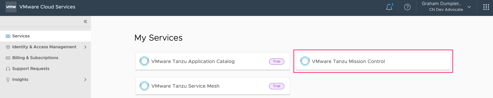
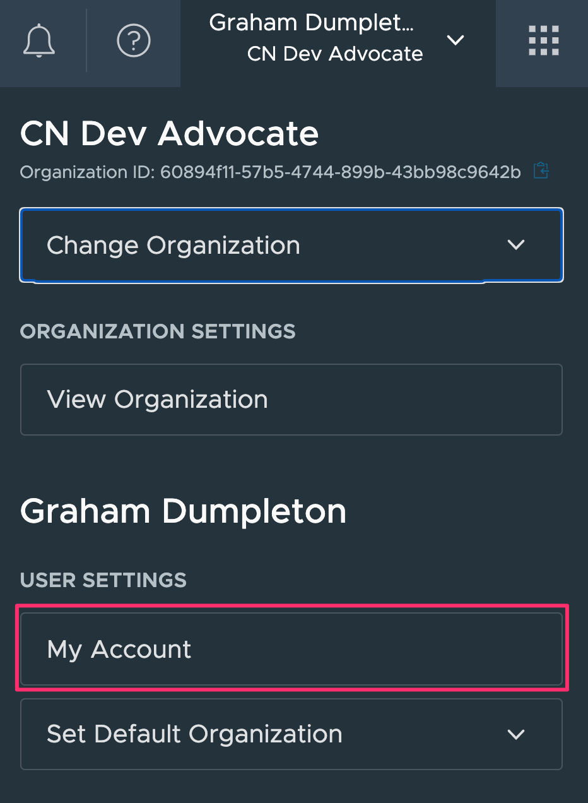
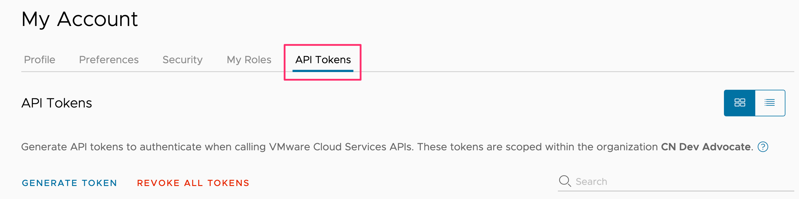

To prepare the workshop environment you will first need to login to VMware Cloud Services.

```dashboard:open-url
url: https://console.cloud.vmware.com/
```

When you are at the VMware Cloud Services console, verify that you have access to VMware Tanzu Mission Control.



Note that if you are a member of multiple organizations you will need to select the specific organization under which VMware Tanzu Mission Control is being made available to you.

In order to be able to access the TMC REST API we first need to generate an access token for VMware Cloud Services.

From the VMware Cloud Services console click on the user dropdown menu top right and select "My Account".



From the page that is then displayed, click on the "API Tokens" tab.



