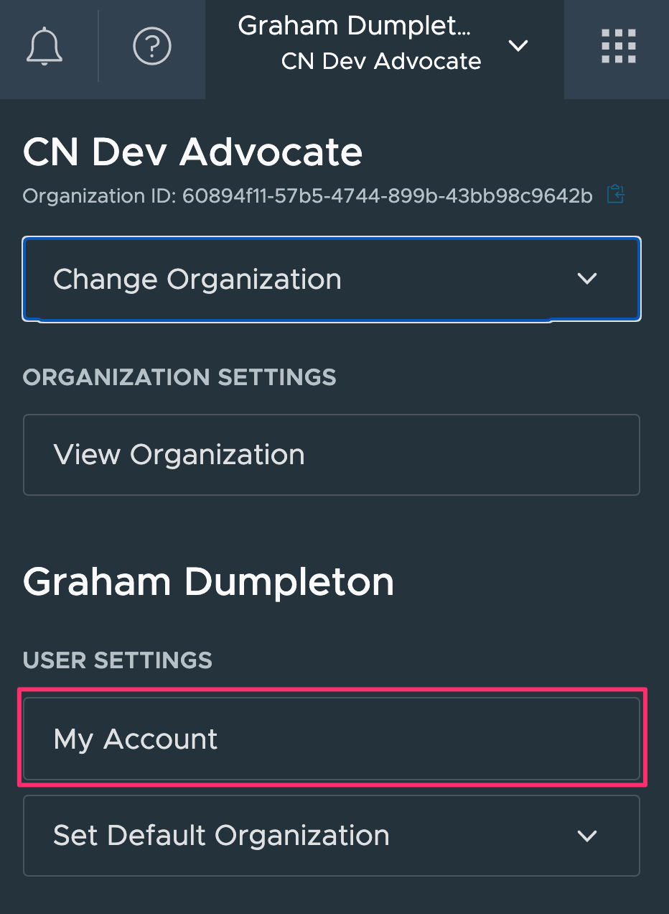

In order to be able to access the TMC REST API, it is necessary to first generate an access token which can be used.

From the VMware Cloud Services console click on the user dropdown menu top right and select "My Account".

From the page that is then displayed, click on the "API Tokens" tab.

