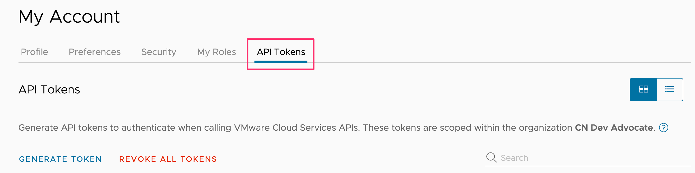

In order to be able to access the TMC REST API we first need to generate an access token for VMware Cloud Services.

From the VMware Cloud Services console click on the user dropdown menu top right and select "My Account".

From the page that is then displayed, click on the "API Tokens" tab.

