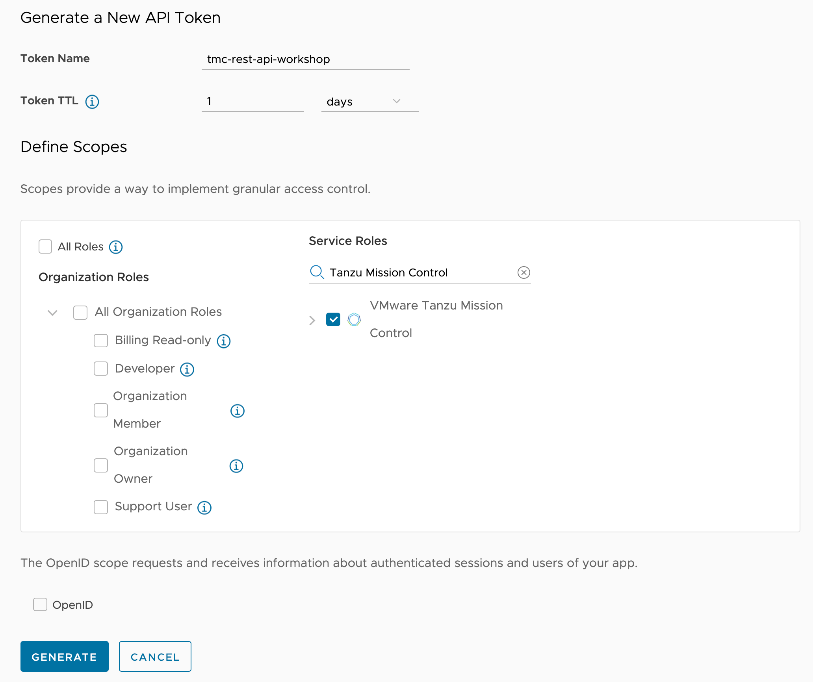
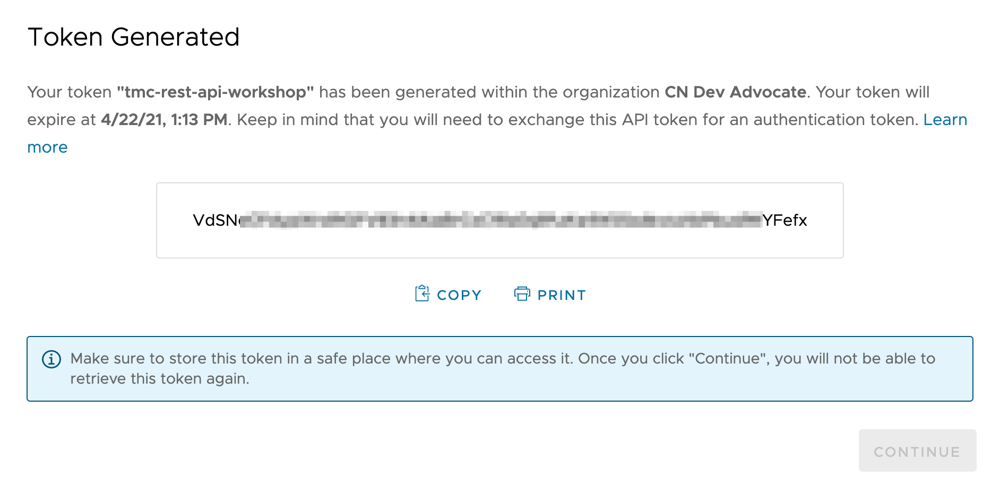

Although you may have existing API tokens you could use, we will create a new API token for this workshop.

To create the access token click on "GENERATE TOKEN".

Call the new token "tmc-rest-api-workshop".

Set the token time to live (TTL) to 1 day.

Under "Service Roles", search for "VMware Tanzu Mission Control" and select it.

Then click on "GENERATE".

This will result in a popup being displayed with the details of the token.

DO NOT dismiss this popup just yet as we will need to copy the access token in a subsequent step.
