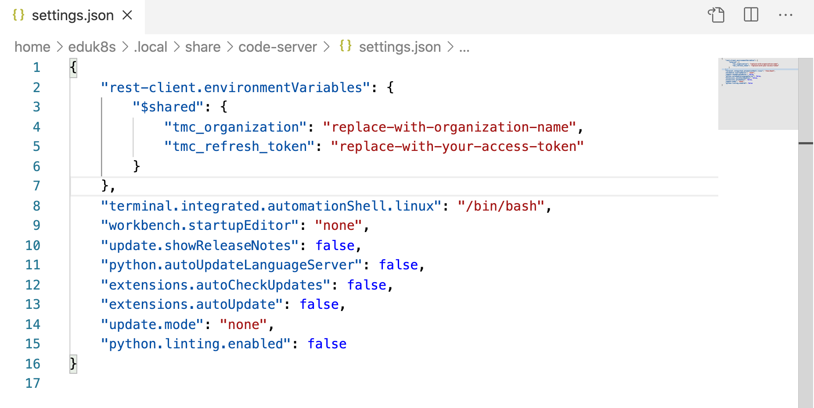

For this workshop we will initially be using a VS Code Editor extension to exercise the TMC REST API.

To save you needing to enter the access token in multiple places, we will add it once to the configuration for the REST API testing tool.

Click on the action below to bring up the VS Code Editor user settings, or within the editor bring up the command pallete, search for "Preferences: Open Settings (JSON)" and select it.

```editor:execute-command
command: workbench.action.openSettingsJson
```

Click on the action below to copy the configuration snippet:

```workshop:copy-any-edit
    "rest-client.environmentVariables": {
        "$shared": {
            "tmc_organization": "replace-with-organization-name",
            "tmc_refresh_token": "replace-with-your-access-token"
        }
    },
```

Paste this immediately after the opening brace of the settings to yield:



Now return to the VMware Cloud Services console and click on "COPY" in the popup showing the generated access token. Replace the string "replace-with-your-access-token" in the VS Code Editor user settings.

You will also need to replace the string "replace-with-organization-name" with the slug name for the VMware Cloud Services organization you are using. Unfortunately this name is not displayed in the popup displaying the generated access token, or anywhere else in the VMWare Cloud Services console, so you will need to work out what it is from the URL when accessing the Tanzu Mission Control web interface.
