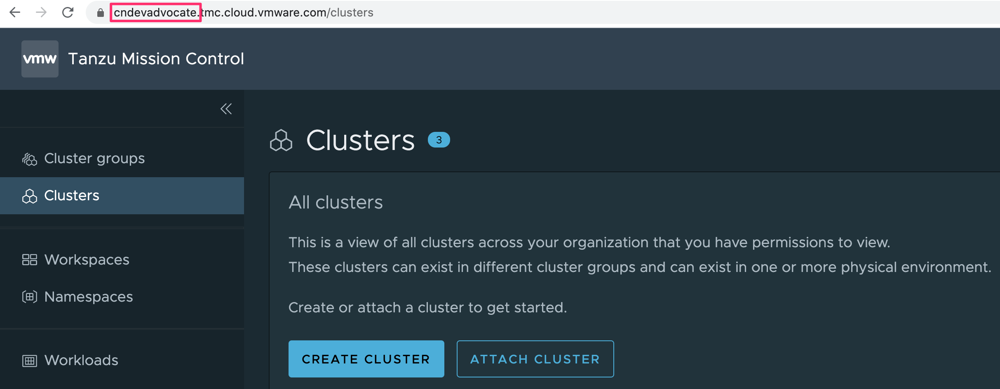

Back in the VMware Cloud Services console, dismiss the popup displaying the generated access token by clicking on "CONTINUE".

Next click on "Services" in the left hand sidebar menu to display again the services you have available, and click on "Tanzu Mission Control".

This should redirect you to the Tanzu Mission Control web console.

Take note of the initial host name appearing in the fullly qualified hostname of the URL, this is the slug name for the organization you are using with VMware Cloud Services.

Replace the string "replace-with-organization-name" in the VS Code Editor user settings with this value and save the settings.

The fully qualified hostname of the URL for the TMC web console is also the hostname for where the TMC REST API will be hosted. This is why we needed the initial hostname, as it will be used to fill in the hostname used when making the REST API calls.
