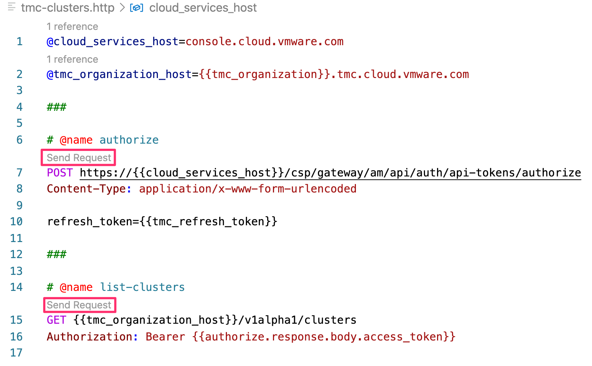

To test that the configuration for the REST API client has been set correctly, click below to open up in the editor the file "tmc-clusters.http".

```editor:open-file
file: ~/exercises/tmc-clusters.http
```

This should display an input file for the VS Code Editor REST client extension being used.



In the input file you should see the highlighted "Send Request" text.

Click on "Send Request" under the named "authorize" action. When clicked it should pop up on the right hand side a new editor pane showing the result of the call. If the access token has been set correctly in the REST API client configuration, you should get back a successful response indicating the REST API client could log into the VMware Cloud Services endpoint.

If successful, click on "Send Request" under the named "list-clusters" action. This will make a REST API client call to TMC, using the TMC specific access token returned from VMware Cloud Services when authenticating against it. If successful, you should see a list returned with any clusters you may already have created using TMC.
